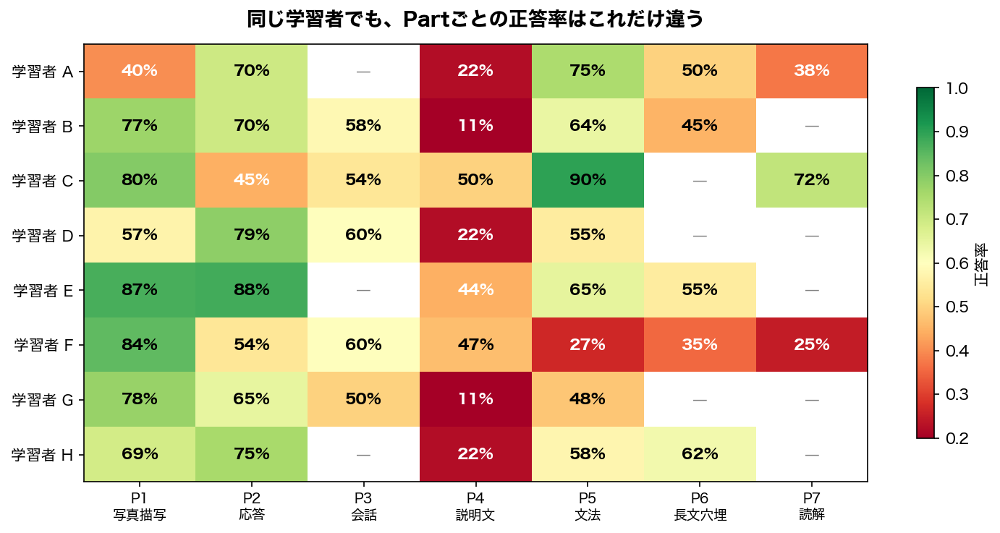

# Adaptive Learning with Knowledge Tracing

> テスト対策アプリで、次に何を出せば一番効果的か？

EdNet の実データ（78万ユーザー・1.3億インタラクション）を使い、**Knowledge Tracing → Item Selection** のパイプラインを設計・実装するプロジェクト。

## 背景

```
従来の学習アプリ                    アダプティブラーニング
─────────────────                   ─────────────────────
全員に同じ問題を順番に出す          学習者ごとの知識状態を推定し出題

学習者A ─→ Q1, Q2, Q3, Q4 ...      学習者A ─→ 文法が苦手
学習者B ─→ Q1, Q2, Q3, Q4 ...        → 文法の中難度問題を優先
学習者C ─→ Q1, Q2, Q3, Q4 ...      学習者B ─→ リスニングが苦手
     (一律)                           → リスニング強化問題を出題

結果: 簡単すぎ/難しすぎの問題に      結果: 各学習者の「伸びしろ」に
      時間を浪費                          集中して学習できる
```

問題の本質は **学習者ごとにスキル別の知識状態が異なるのに、それを無視して一律に出題していること** にある。正答率だけで難易度を調整しても、「文法は得意だがリスニングは苦手」という構造は捉えられない。

実際にデータを見ると、このばらつきは明らかだった。



学習者Cは文法90%だが応答45%。学習者Gは写真描写78%だが説明文11%。**同じ人の中でもスキルごとの得意・不得意がこれだけ違う**のに、全員に同じ問題を順番に出しても意味がない。

Knowledge Tracing (KT) は、解答履歴からスキルごとの習熟度がどう変化しているかを推定する技術で、KT の出力があれば **Zone of Proximal Development** — 難しすぎず易しすぎないちょうどいい領域 — に問題を合わせられる。

## Architecture

Computerized Adaptive Testing (CAT) の枠組みに沿って、2段階のパイプラインで構成する。

```
学習者の解答ログ
       │
       ▼
┌─────────────────────────────────────────────────────┐
│                                                      │
│  Knowledge Tracing — 知識状態の推定                   │
│  ┌─────────────┐  ┌──────────────────────────────┐  │
│  │ IRT 2PL     │  │ DKT / SAKT / SimpleKT        │  │
│  │ BKT         │  │ (PyTorch Lightning)           │  │
│  │ (説明可能性)│  │ (予測精度)                    │  │
│  └─────────────┘  └──────────────────────────────┘  │
│           │                    │                     │
│           ▼                    ▼                     │
│  Item Selection — 出題戦略                           │
│  ┌───────────────────────────────────────────────┐  │
│  │ Random / Difficulty Matching / Thompson Smpl   │  │
│  └───────────────────────────────────────────────┘  │
│                                                      │
└─────────────────────────────────────────────────────┘
       │
       ▼
  次の一問
```

## Notebooks

| # | 問い | 手法 | 示す能力 |
|---|------|------|---------|
| [01](notebooks/01-eda.qmd) | 学習者はどう行動しているか？ | Polars, Matplotlib | ドメイン理解、データリテラシー |
| [02](notebooks/02-irt-bkt.qmd) | 学習者の「知識」を測れるか？ | PyMC (IRT 2PL), pyBKT | ベイズ推論、古典モデルの説明可能性 |
| [03](notebooks/03-deep-kt.qmd) | Deep Learning で精度は上がるか？ | PyTorch Lightning, MLflow | DL実装力、実験管理 |
| [04](notebooks/04-item-selection.qmd) | 「次の一問」をどう選ぶか？ | シミュレーション | KTの出口設計、出題ポリシー比較 |

## Implementation Phases

| Phase | 内容 | 状態 |
|-------|------|------|
| 0 | 環境構築 + EDA | **完了** |
| 1 | `src/features/` + 02-irt-bkt.qmd — 前処理パイプライン + 古典モデル | 次に着手 |
| 2 | `src/models/` + `src/training/` + 03-deep-kt.qmd — 深層KTモデル比較 | |
| 3 | `src/policy/` + 04-item-selection.qmd — 出題戦略シミュレーション | |

## Quick Start

```bash
uv sync                                   # 依存インストール
make download                              # EdNet-KT1 データ取得
make test                                  # pytest
make render FILE=notebooks/01-eda.qmd      # Quarto → HTML
```

## Project Structure

```
├── notebooks/           # Quarto (.qmd) — 分析ノートブック
├── src/
│   ├── data/            # ダウンロード・ローダ・サンプリング
│   ├── features/        # 前処理パイプライン (elapsed_time クリッピング、系列長フィルタ等)
│   ├── models/
│   │   ├── irt.py       # IRT 2PL (PyMC)
│   │   ├── bkt.py       # BKT wrapper (pyBKT)
│   │   ├── dkt.py       # Deep Knowledge Tracing (LSTM)
│   │   ├── sakt.py      # Self-Attentive KT
│   │   └── simplekt.py  # SimpleKT
│   ├── training/        # PyTorch Lightning modules
│   ├── eval/            # AUC, calibration, metrics
│   └── policy/          # Item Selection (random, difficulty matching, Thompson sampling)
├── tests/               # pytest
├── data/{raw,processed} # gitignore
└── mlruns/              # MLflow (gitignore)
```

## Dataset

**EdNet-KT1**: ~780K users, ~130M interactions, 188 skill tags, TOEIC Part 1–7.
本プロジェクトでは 5,000 ユーザーをサンプリング (~550K rows)。

[Paper](https://arxiv.org/abs/2002.08038) / [GitHub](https://github.com/riiid/ednet)

## Tech Stack

| カテゴリ | ライブラリ |
|---------|-----------|
| データ処理 | Polars, Matplotlib |
| 古典モデル | PyMC (IRT 2PL), pyBKT |
| 深層学習 | PyTorch, Lightning |
| 実験管理 | MLflow |
| 環境 | Python 3.11, uv, Quarto |

## References

**データセット**
- Choi et al. (2020). *EdNet: A Large-Scale Hierarchical Dataset in Education*. L@S. [arXiv:2002.08038](https://arxiv.org/abs/2002.08038)

**古典モデル (02-irt-bkt)**
- Corbett & Anderson (1994). *Knowledge Tracing: Modeling the Acquisition of Procedural Knowledge*. UMUAI.

**深層モデル (03-deep-kt)**
- Piech et al. (2015). *Deep Knowledge Tracing*. NeurIPS.
- Pandey & Karypis (2019). *A Self-Attentive model for Knowledge Tracing*. EDM.
- Liu et al. (2023). *SimpleKT: A Simple But Tough-to-Beat Baseline for Knowledge Tracing*. ICLR.

**出題戦略 (04-item-selection)**
- Clement et al. (2015). *Multi-Armed Bandits for Intelligent Tutoring Systems*. JEDM.
- Ghosh et al. (2021). *BOBCAT: Bilevel Optimization-Based Computerized Adaptive Testing*. IJCAI.

## License

MIT
